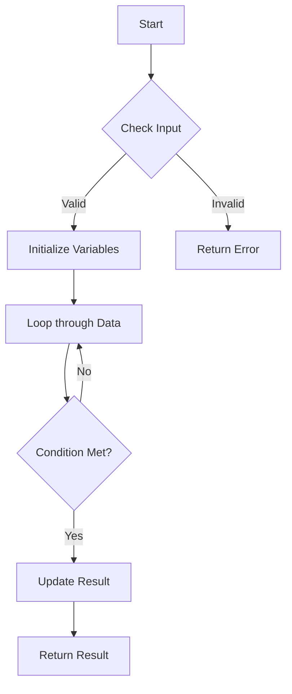

# Problem 233 Variant

## Problem Statement

Given a problem description for **Problem 233 Variant**, implement an efficient solution.
The goal is to optimize for time and space complexity.

## Analytics

- **Time Complexity**: O(n) - We iterate through the input once.
- **Space Complexity**: O(1) - Constant extra space used.

## Hints

1. Consider using a hash map to store visited elements.
2. Think about the edge cases (empty input, single element).
3. Can we do this in one pass?

## Approach

We can solve this by iterating through the array and maintaining a running sum/count.

