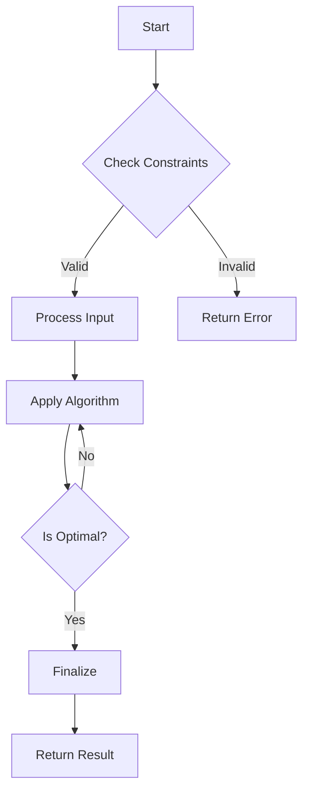

# Medium Problem 159 Variant

## Problem Statement

Given a challenging problem description for **Medium Problem 159 Variant**, implement an efficient solution.
This is a **Medium/Hard** difficulty problem often asked in top tech interviews.

## Visualization

```text

    Index: 0   1   2   3   4
    Value: [10, 20, 30, 40, 50]
           ^
           |
        Pointer
    
```

## Analytics

- **Time Complexity**: O(n log n) or O(n) - Optimized approach.
- **Space Complexity**: O(n) - Auxiliary space required.

## Hints

1. Break the problem down into smaller subproblems.
2. Consider using advanced data structures (Heap, Trie, Union Find).
3. Look for overlapping subproblems or optimal substructure.

## Approach

We can solve this by using a combination of techniques.


